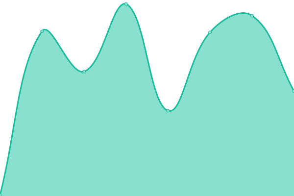
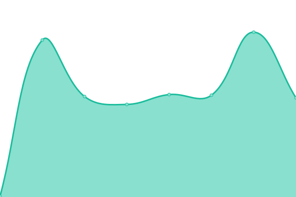

# [📈 Live Status](https://zuedev.github.io/my-upptime): <!--live status--> **🟩 All systems operational**

This repository contains the open-source uptime monitor and status page for [Alex](zue.dev), powered by [Upptime](https://github.com/upptime/upptime).

With [Upptime](https://upptime.js.org), you can get your own unlimited and free uptime monitor and status page, powered entirely by a GitHub repository. We use [Issues](https://github.com/zuedev/my-upptime/issues) as incident reports, [Actions](https://github.com/zuedev/my-upptime/actions) as uptime monitors, and [Pages](https://zuedev.github.io/my-upptime) for the status page.

<!--start: status pages-->
<!-- This summary is generated by Upptime (https://github.com/upptime/upptime) -->
<!-- Do not edit this manually, your changes will be overwritten -->
<!-- prettier-ignore -->
| URL | Status | History | Response Time | Uptime |
| --- | ------ | ------- | ------------- | ------ |
|  [zue.dev](https://zue.dev) | 🟩 Up | [zue-dev.yml](https://github.com/zuedev/my-upptime/commits/HEAD/history/zue-dev.yml) | 

 184ms
     
 | 

<a href="https://zuedev.github.io/my-upptime/history/zue-dev">96.80%</a>
    

|  [t1.zue.dev](https://t1.zue.dev) | 🟩 Up | [t1-zue-dev.yml](https://github.com/zuedev/my-upptime/commits/HEAD/history/t1-zue-dev.yml) | 

 231ms
     
 | 

<a href="https://zuedev.github.io/my-upptime/history/t1-zue-dev">96.80%</a>
    

|  [96.zue.dev](https://96.zue.dev) | 🟩 Up | [96-zue-dev.yml](https://github.com/zuedev/my-upptime/commits/HEAD/history/96-zue-dev.yml) | 

 185ms
     
 | 

<a href="https://zuedev.github.io/my-upptime/history/96-zue-dev">96.80%</a>
    

|  [unnamed.group](https://unnamed.group) | 🟩 Up | [unnamed-group.yml](https://github.com/zuedev/my-upptime/commits/HEAD/history/unnamed-group.yml) | 

 172ms
     
 | 

<a href="https://zuedev.github.io/my-upptime/history/unnamed-group">40.99%</a>
    

|  [teamsweets.com](https://teamsweets.com) | 🟩 Up | [teamsweets-com.yml](https://github.com/zuedev/my-upptime/commits/HEAD/history/teamsweets-com.yml) | 

 199ms
     
 | 

<a href="https://zuedev.github.io/my-upptime/history/teamsweets-com">100.00%</a>
    

|  [yayjaybae.com](https://yayjaybae.com) | 🟩 Up | [yayjaybae-com.yml](https://github.com/zuedev/my-upptime/commits/HEAD/history/yayjaybae-com.yml) | 

 170ms
     
 | 

<a href="https://zuedev.github.io/my-upptime/history/yayjaybae-com">100.00%</a>
    

<!--end: status pages-->

[**Visit our status website →**](https://zuedev.github.io/my-upptime)

## 📄 License

- Powered by: [Upptime](https://github.com/upptime/upptime)
- Code: [MIT](./LICENSE) © [Anand Chowdhary](https://anandchowdhary.com), supported by [Pabio](https://pabio.com)
- Data in the `./history` directory: [Open Database License](https://opendatacommons.org/licenses/odbl/1-0/)
